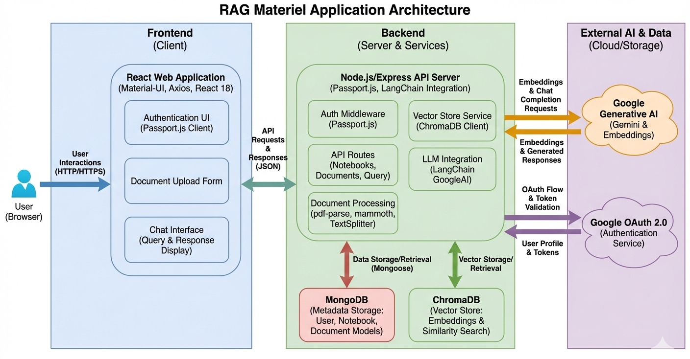

# Materiel Server - Document Q&A with LangChain

A Node.js Express server that provides document upload and question-answering capabilities using LangChain, Google Gemini, and ChromaDB vector storage.

## Demo

[Watch the project video](https://drive.google.com/file/d/1em5Wt8vJrWYTh_oq11Gfx6isRHGyab0R/view?usp=drive_link)

## Architecture

- **Controllers**: Handle HTTP requests and responses
- **Services**: Contain business logic for document processing and LangChain operations
- **Vector Store**: ChromaDB (with MemoryVectorStore fallback)
- **Embeddings**: Google Gemini text-embedding-004
- **LLM**: Google Gemini for question answering



## Features

- **Document Ingestion**: Upload text documents that are automatically chunked, embedded, and stored in vector database
- **Question Answering**: Query uploaded documents using natural language and get AI-powered responses
- **Clean Architecture**: Modular structure with controllers, services, routes, and middlewares
- **Error Handling & Logging**: Comprehensive error handling and Winston-based logging
- **Environment Configuration**: dotenv-based configuration management

## Project Structure

```
src/
├── config/          # Environment configuration
├── controllers/     # Request handlers
├── middlewares/     # Express middlewares (logging, error handling)
├── routes/          # API route definitions
├── services/        # Business logic (LangChain, vector store)
└── utils/           # Utility functions
```

## Prerequisites

- Node.js 18+
- Google Gemini API key
- ChromaDB running locally (optional - falls back to in-memory storage if unavailable)

## Installation

1. Clone the repository
2. Install dependencies:
   ```bash
   npm install
   ```

3. Set up environment variables in `.env`:
   ```env
   PORT=3000
   GOOGLE_API_KEY=your_google_api_key_here
   GOOGLE_TEXT_MODEL=gemini-2.0-flash
   CHROMA_URL=http://localhost:8000
   LOG_LEVEL=info
   ```

4. Start ChromaDB (if using local instance):
   ```bash
   # Using Docker
   docker run -p 8000:8000 chromadb/chroma
   ```

## Usage

### Development
```bash
npm run dev
```

### Production
```bash
npm start
```

### API Documentation

## Base URL
```
http://localhost:3000
```

## Authentication
Currently, no authentication is required for the API endpoints.

## Endpoints

### Health Check
Check if the server is running and healthy.

**Endpoint:** `GET /health`

**Response:**
```json
{
  "status": "OK",
  "timestamp": "2025-12-04T12:20:35.314Z"
}
```

**Status Codes:**
- `200` - Server is healthy

---

### Upload Document
Upload and process a text document for RAG (Retrieval-Augmented Generation).

**Endpoint:** `POST /api/documents/upload`

**Content-Type:** `multipart/form-data`

**Parameters:**
- `document` (file, required) - Text file to upload (.txt, .md, etc.)

**Request Example:**
```bash
curl -X POST -F "document=@sample.txt" http://localhost:3000/api/documents/upload
```

**Success Response (200):**
```json
{
  "message": "Document uploaded and processed successfully",
  "success": true,
  "chunks": 5
}
```

**Error Responses:**
- `400` - No file uploaded
```json
{
  "error": "No file uploaded"
}
```
- `500` - Server error during processing

---

### Query Documents
Ask questions about the uploaded documents using AI-powered retrieval and generation.

**Endpoint:** `POST /api/documents/query`

**Content-Type:** `application/json`

**Request Body:**
```json
{
  "query": "string (required) - Your question about the documents"
}
```

**Request Example:**
```bash
curl -X POST -H "Content-Type: application/json" \
     -d '{"query":"What are the main topics covered?"}' \
     http://localhost:3000/api/documents/query
```

**Success Response (200):**
```json
{
  "query": "What are the main topics covered?",
  "answer": "Based on the uploaded documents, the main topics covered include...",
  "sourceDocuments": [
    {
      "content": "Document chunk content here...",
      "metadata": {
        "filename": "sample.txt",
        "mimetype": "text/plain",
        "size": 1024,
        "uploadedAt": "2025-12-04T12:20:35.304Z"
      }
    }
  ]
}
```

**Error Responses:**
- `400` - Missing query parameter
```json
{
  "error": "Query is required"
}
```
- `500` - Server error during processing

---

## Error Handling

All API endpoints follow a consistent error response format:

```json
{
  "error": "Error message description"
}
```

Common HTTP status codes:
- `200` - Success
- `400` - Bad Request (missing/invalid parameters)
- `500` - Internal Server Error

## Rate Limiting

Currently, no rate limiting is implemented.

## File Upload Limits

- **File Size**: Limited by server memory (consider implementing size limits for production)
- **File Types**: Text-based files (.txt, .md, .csv, etc.)
- **Encoding**: UTF-8 required

## Example Usage

1. Start the server:
   ```bash
   npm run dev
   ```

2. Upload a document:
   ```bash
   curl -X POST -F "document=@sample.txt" http://localhost:3000/api/documents/upload
   ```

3. Ask questions:
   ```bash
   curl -X POST -H "Content-Type: application/json" \
        -d '{"query":"Summarize the key points"}' \
        http://localhost:3000/api/documents/query
   ```
## Configuration
All configuration is managed through environment variables:

- `PORT`: Server port (default: 3000)
- `GOOGLE_API_KEY`: Your Google Gemini API key
- `GOOGLE_TEXT_MODEL`: Google Gemini model name (default: gemini-2.0-flash)
- `CHROMA_URL`: ChromaDB server URL
- `LOG_LEVEL`: Logging level (error, warn, info, debug)

## Development

The project uses ES modules and follows modern Node.js best practices. Key technologies:

- Express.js with ESM
- LangChain for AI workflows
- ChromaDB for vector storage
- Winston for logging
- Multer for file uploads

## License

ISC